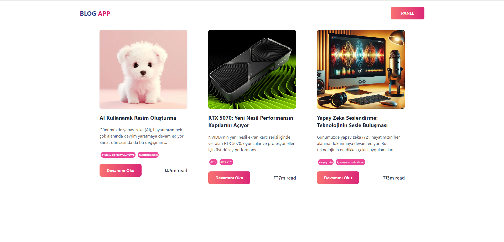
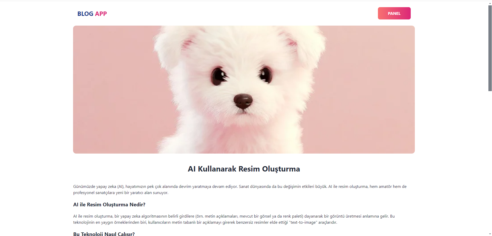
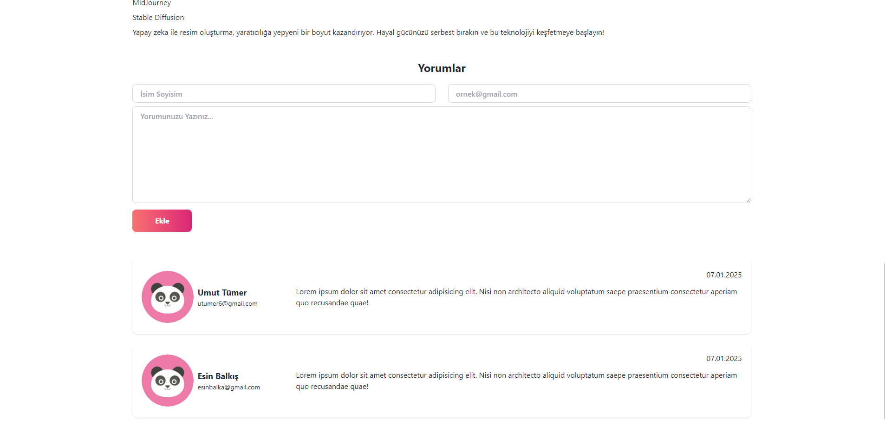
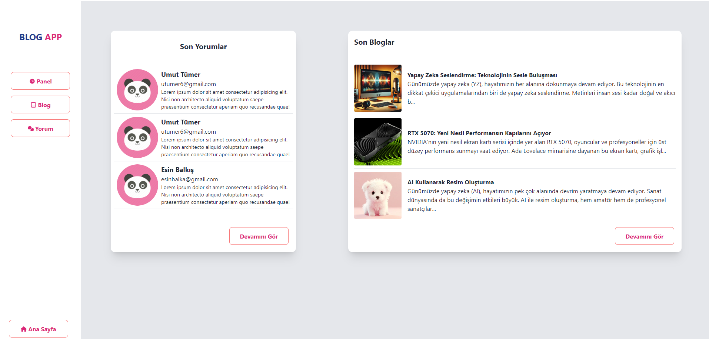
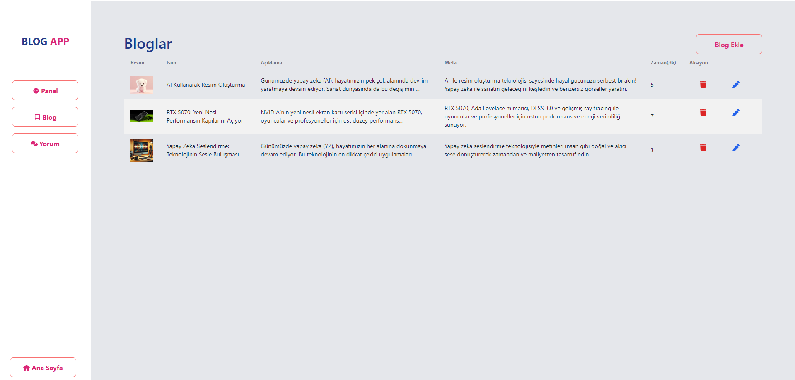
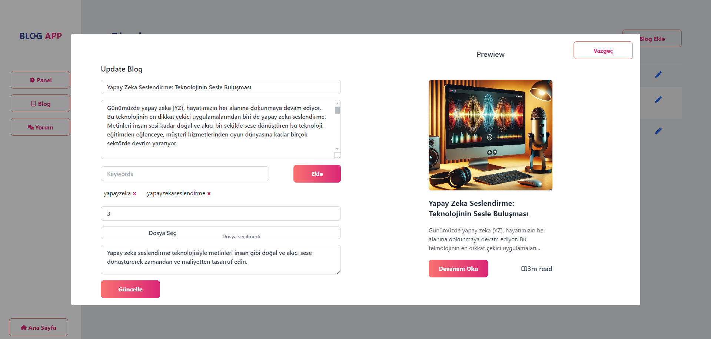
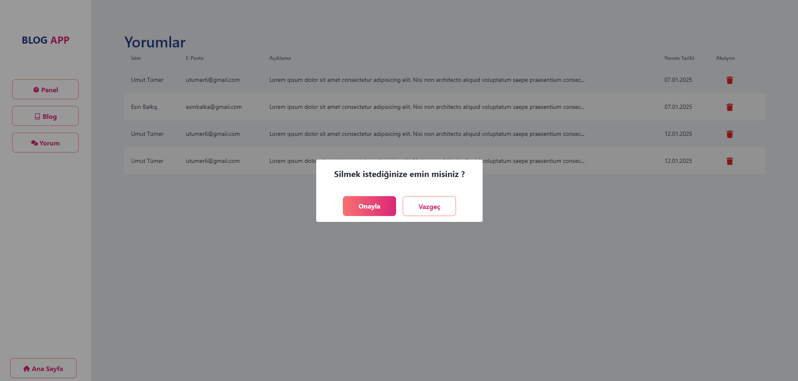

# Blog App With React

- React kullanılarak yapılmış bir blog uygulamasıdır. 
- React-Helmet paketiyle blog yazılarına ve siteye temel SEO ayarlamaları yapılmıştır.
- Custom componentler kullanılarak proje modüler hale getirilmiştir.
- React-Router ve React-Router-Dom kullanılarak sayfalar arası geçiş sağlanmıştır.
- Anlık  olarak CRUD işlemleri yapabilmek için json-server paketi kullanılmıştır.
- State yönetimi için Redux-Toolkit kullanılmıştır.

### `npm start`
[http://localhost:3000] portunda projeyi başlatır

### `npm run api`
[http://localhost:3005] portunda projenin json server'ini başlatır

## Ekran Görüntüleri

